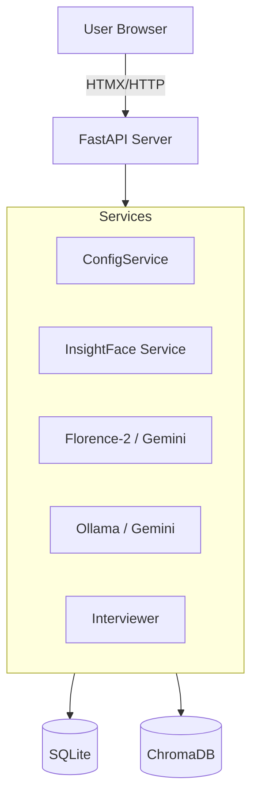

# System Architecture & Patterns

## Architecture Overview
The system follows a **Monolithic Service-Based Architecture** using Python backend and Server-Side Rendered (SSR) frontend.

### High-Level Diagram

## Key Design Patterns

### 1. The "Strict Config" Pattern (`services/config.py`)
Configuration follows a defined hierarchy to support both granular UI control and secure environment setup:
*   **Layer 1 (DB)**: Runtime settings managed via the `Manage` UI. (Highest Priority)
*   **Layer 2 (Env)**: Infrastructure secrets (API Keys) and initial build configuration.
*   **Layer 3 (Code)**: System defaults (e.g. `classic` theme) for immediate stability.

### 2. The Hybrid AI Router Strategy (`services/analyzer.py`)
The `ImageAnalyzer` service balances resource usage and capability via strict routing:
*   **Router Logic**: Checks `config.ai_provider`.
    *   `gemini`: Invokes `services/gemini.py`. Handles validation and returns errors if unconfigured.
    *   `local`: Invokes `Florence-2` model (loaded in-memory).
    *   `none` (Default): Returns empty results, keeping the system lightweight.

### 3. Asynchronous Background Processing
Resource-intensive tasks are decoupled from the main request thread using FastAPI `BackgroundTasks`:
*   **Pipeline**: Upload Request -> File Save -> 200 OK Response -> Background Task (Resize → Thumbnails → Metadata Extraction → AI Queue).

### 4. Server-Driven UI (HTMX)
The frontend architecture minimizes client-side complexity:
*   **Pattern**: User Interactions (Clicks/Scrolls) -> Server generates HTML -> HTMX swaps DOM elements.
*   **Implementation**: Used for Infinite Scroll (`manage_row.html`), Modal Content (`daily_memory.html`), and Form Submission (`settings/update`).
